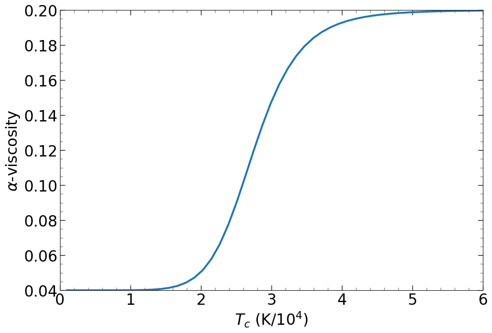
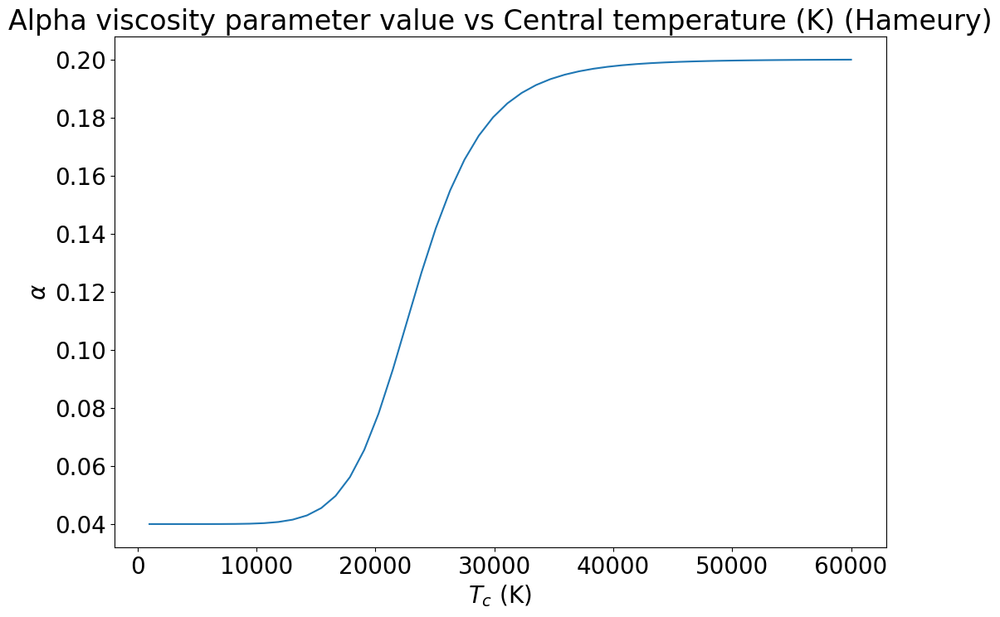
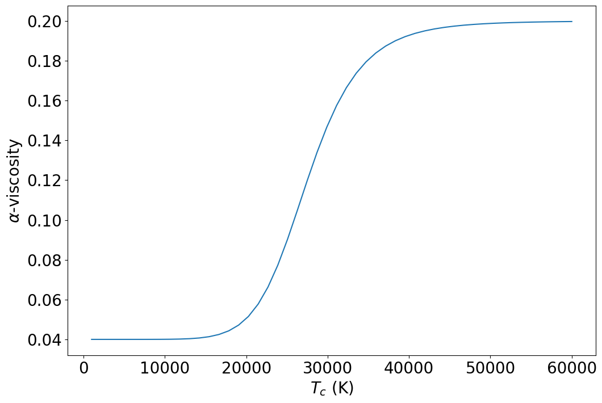

```python
import numpy as np
from numba import jit, cuda
import matplotlib.pyplot as plt
import unicodeit
from matplotlib.ticker import (MultipleLocator, FormatStrFormatter,
                               AutoMinorLocator)
%matplotlib inline

alpha_cold = 0.04
alpha_hot = 0.2

def alpha_visc(T_c):
    
    log_alpha_0 = np.log(alpha_cold)
    log_alpha_1 = np.log(alpha_hot) - np.log(alpha_cold)
    log_alpha_2 = (1 + (2.5e4 / T_c)**8)
    
    log_alpha = log_alpha_0 + log_alpha_1 / log_alpha_2
    
    alpha_visc = np.exp(log_alpha)
    
    return alpha_visc  

G = 6.67430e-8  # Gravitational constant (cm^3 g^-1 s^-2)
M_sun = 1.989e33  # Mass of the Sun (g)
M_star = M_sun*9   # Mass of central star (g)
k_B = 1.380649e-16  # Boltzmann constant (erg/K)
m_p = 1.6726219e-24  # Proton mass (g)
sigma_SB = 5.670374419e-5  # Stefan-Boltzmann constant (erg cm^-2 s^-1 K^-4)
r_cons = 8.31446261815324e7 # Molar gas constant in cgs
M_dot = 1e17  # Mass transfer rate (g/s)
a_const = 7.5657e-15  # Radiation density constant (erg cm^-3 K^-4)
mu = 0.5  # Mean molecular weight for ionized gas of pure hydrogen
c = 2.99792458e10  # Speed of light (cm/s)
```


```python
example_Tc = np.linspace(1e3,6e4)
example_al = alpha_visc(example_Tc)
```


```python
font = {'weight' : 'normal',
        'size'   : 24}
    
plt.rc('font', **font)
def plot_alphat(T_c,alpha_v):
    y_values = alpha_v
    x_values = T_c/1e4
    plt.figure(figsize=(12, 8))
    plt.plot(x_values, y_values,linewidth=3)
    plt.xlabel(r'$T_c$ (K/$10^4$)')
    plt.ylabel(r'$\alpha$-viscosity')
    plt.minorticks_on()
    plt.tick_params(axis='both', which='major', direction='in', length=8, width=1, colors='black')
    plt.tick_params(axis='both', which='minor', direction='in', length=4, width=1, colors='gray')
    plt.tick_params(axis='both', which='both', top=True, right=True, direction='in')
    plt.tick_params(labeltop=False, labelright=False)  # Hide labels on top and right
    plt.xlim(0,6)
    plt.ylim(0.04,0.2)
    plt.show()

# Call the plotting function
plot_alphat(example_Tc,example_al)
```


    

    


```python
r = np.linspace(1e3, 1e10)
Sigma = np.full(1000, 1e1)
nu = np.full(1000, 1e10)


def Flux_irr(Sigma_array, nu, r, r_array):
    
    M_dot_boundary = M_dot
    C = 5e-3
    
    L_edd = 1.4e38 * (M_star / M_sun)
    M_dot_inner = 2 * np.pi * r_array[1] * Sigma_array[1] * 3 * nu[1] / r_array[1] 
    L_inner = M_dot_inner * c ** 2
    
    if M_dot_inner >= M_dot_boundary:
        epsilon = 0.1
    else:
        epsilon = 0.1 * (M_dot_inner/M_dot_boundary)
    
    L_x = epsilon * min(L_edd,L_inner)
    
    Flux = C * L_x / (4 * np.pi * r ** 2)
    
    return Flux

def Epsilon_irr(Sigma, nu, r):
    
    M_dot_boundary = M_dot
    C = 5e-3
    
    L_edd = 1.4e38 * (M_star / M_sun)
    M_dot_inner = 2 * np.pi * r[1] * Sigma[1] * 3 * nu[1] / r[1] 
    L_inner = M_dot_inner * c ** 2
    
    if M_dot_inner >= M_dot_boundary:
        epsilon = 0.1
    else:
        epsilon = 0.1 * (M_dot_inner/M_dot_boundary)
    
    L_x = epsilon * min(L_edd,L_inner)
    
    T_irr = (C * L_x / (4 * np.pi * sigma_SB * r ** 2))**(1/4)
    
    return (T_irr/1e4)**2

def r10(r):
    return r/1e10

def Sigma_max(Sigma, nu, r):
    a1 = 10.8 - 10.3*Epsilon_irr(Sigma, nu, r)
    a2 = alpha_cold**(-0.84)
    a3 = (M_star/M_sun)**(-0.37+0.1*Epsilon_irr(Sigma, nu, r))
    a4 = r10(r)**(1.11-0.27*Epsilon_irr(Sigma, nu, r))
    return a1*a2*a3*a4

def Sigma_min(Sigma, nu, r):
    a1 = 8.3 - 7.1*Epsilon_irr(Sigma, nu, r)
    a2 = alpha_hot**(-0.77)
    a3 = (M_star/M_sun)**(-0.37)
    a4 = r10(r)**(1.12-0.23*Epsilon_irr(Sigma, nu, r))
    return a1*a2*a3*a4

def T_c_max(Sigma, nu, r):
    a1 = 10700*alpha_cold**(-0.1)
    a2 = r10(r)**(-0.05*Epsilon_irr(Sigma, nu, r))
    return a1*a2

def T_c_min(Sigma, nu, r):
    a1 = 20900 - 11300*Epsilon_irr(Sigma, nu, r)
    a2 = alpha_hot**(-0.22)
    a3 = (M_star/M_sun)**(-0.01)
    a4 = r10(r)**(0.05-0.12*Epsilon_irr(Sigma, nu, r))
    a5 = a1*a2*a3*a4
    return np.maximum(a5, 1e-3)
    
def alpha_visc_irr(T_c, Sigma, nu, r):
    
    T_crit = 0.5*(T_c_max(Sigma, nu, r)+T_c_min(Sigma, nu, r))
    
    log_alpha_0 = np.log(alpha_cold)
    log_alpha_1 = np.log(alpha_hot) - np.log(alpha_cold)
    log_alpha_2 = (1 + (T_crit / T_c)**8)
    log_alpha = log_alpha_0 + log_alpha_1 / log_alpha_2
    alpha_visc = np.exp(log_alpha)
    
    return alpha_visc  
```


```python
a2 = alpha_visc_irr(example_Tc, Sigma, nu, r)
a2
```

    C:\Users\jezre\AppData\Local\Temp\ipykernel_16600\2496028586.py:65: RuntimeWarning: overflow encountered in power
      a2 = r10(r)**(-0.05*Epsilon_irr(Sigma, nu, r))
    C:\Users\jezre\AppData\Local\Temp\ipykernel_16600\2496028586.py:72: RuntimeWarning: overflow encountered in power
      a4 = r10(r)**(0.05-0.12*Epsilon_irr(Sigma, nu, r))
    


    array([0.04      , 0.04      , 0.04000005, 0.04000051, 0.04000301,
           0.0400128 , 0.04004334, 0.04012423, 0.04031378, 0.04071714,
           0.04151099, 0.04297366, 0.04551513, 0.04969036, 0.05615723,
           0.06551906, 0.07802189, 0.09322676, 0.10994645, 0.12661645,
           0.14186604, 0.15488613, 0.16544947, 0.17372387, 0.1800617 ,
           0.18485387, 0.18845498, 0.1911569 , 0.19318734, 0.19471868,
           0.19587925, 0.19676381, 0.1974421 , 0.1979655 , 0.19837193,
           0.1986895 , 0.19893917, 0.19913662, 0.19929368, 0.1994193 ,
           0.19952031, 0.19960195, 0.19966827, 0.19972238, 0.19976675,
           0.19980328, 0.19983348, 0.19985855, 0.19987944, 0.19989692])


```python
plot_alphat(example_Tc,a2)
```


    

    


```python
def plot_alpha2(T_c,alpha_v,T_2,alpha_2):
    y_values = alpha_v
    x_values = T_c
    y2_values = alpha_2
    x2_values = T_2
    plt.figure(figsize=(12, 8))
    plt.plot(x_values, y_values)
    plt.xlabel('$T_c$ (K)')
    plt.ylabel(r'$\alpha$-viscosity')
#    plt.yscale('log')
#    plt.legend(frameon=False)
#    plt.yscale('log')
#    plt.title('Alpha viscosity parameter value vs Central temperature (K) (Hameury)')
#    plt.grid(True, which="both", ls="--")
#    print(y_values)
    plt.show()
plot_alpha2(example_Tc,example_al,example_Tc,a2)
```


    

    


```python

```
