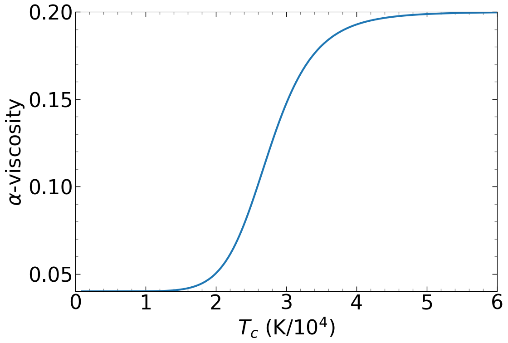

```python
%run GPU_opacity_eqs.ipynb
%run GPU_cre_equations_bath_params.ipynb
%run GPU_cr_graph_normal_bh.ipynb
%run diskequations_SS_bath_params.ipynb
%run GPU_graphformulae_variablealpha_bath.ipynb
```


```python
%%time
font = {'weight' : 'normal',
        'size'   : 20}

plt.rc('font', **font)
plt.figure(figsize=(12, 8))
#plt.title("Plot of T wrt r")
plt.xlabel("r (cm)")
plt.ylabel("T (K))")
plt.yscale("log")
plt.xscale("log")
plt.xlim(r_g(M)*3, 1.48e13)
plt.ylim(1e3, 1e8)

Tmin = 1e2
Tmax = 1e8
r_guess = 1e8
rho_guess = 1e-7
NPanels_old = 10000
NPanels_CR = 20000
M1 = solarmass
Md1 = 5e16

Variable_plot(r_g(M)*3,1e19,M1,Md1,NPanels_old,5)
rad_T_old_plot_2(Tmin, Tmax, 1e15, 1e-0,0.4, NPanels_old)
rad_T_CR_plot_2(Tmin, Tmax, r_guess, rho_guess,0.4, NPanels_CR)

plt.legend().remove()
plt.legend(loc='upper right', borderpad = 0.8, title = "Opacity Type", frameon=False)
```

    CPU times: total: 4.61 s
    Wall time: 5.24 s
    


    <matplotlib.legend.Legend at 0x1d5e78c9420>


    

    


```python
%%time
font = {'weight' : 'normal',
        'size'   : 20}

plt.rc('font', **font)
plt.figure(figsize=(12, 8))
#plt.title("Plot of h wrt r")
plt.xlabel("r (cm)")
plt.ylabel("h (cm))")
plt.yscale("log")
plt.xscale("log")

plt.xlim(r_g(M)*3, 1e12)
plt.ylim(5e4, 1e11)

Tmin = 1e2
Tmax = 1e8
r_guess = 1e8
rho_guess = 1e-7
NPanels_old = 10000
NPanels_CR = 20000
M1 = solarmass
Md1 = 5e16

Variable_plot(r_g(M)*3,1e19,M1,Md1,NPanels_old,1)
rad_h_plot(Tmin, Tmax, r_guess, rho_guess,0.4, NPanels_CR)
rad_h_old_plot(Tmin, Tmax, r_guess, rho_guess,0.4, NPanels_old)

plt.legend().remove()
plt.legend(loc='upper left', borderpad = 0.8, title = "Opacity Type", frameon=False)
```

    CPU times: total: 6.36 s
    Wall time: 7.15 s
    


    <matplotlib.legend.Legend at 0x1d5e34412a0>


    

    


```python
%%time
font = {'weight' : 'normal',
        'size'   : 46}

plt.rc('font', **font)
plt.figure(figsize=(20, 14))
#plt.title("Plot of T wrt Σ")
plt.xlabel(r"$\Sigma$ (g cm$^{-2}$)")
plt.ylabel(r"$T$ (K)")
plt.yscale("log")
plt.xscale("log")
plt.minorticks_on()
plt.tick_params(axis='both', which='major', direction='in', length=24, width=2, colors='black')
plt.tick_params(axis='both', which='minor', direction='in', length=12, width=2, colors='gray')
plt.tick_params(axis='both', which='both', top=True, right=True, direction='in')
plt.tick_params(labeltop=False, labelright=False)  # Hide labels on top and right

plt.xlim(0.9e1, 1.1e3)
plt.ylim(.9e3, 1.1e5)

Tmin = 1e1
Tmax = 1e6
r_guess = 1e11
rho_guess = 1e-8
NPanels = 35000

plot1 = T_Σ_plot(Tmin, Tmax, r_guess, rho_guess,0.04, NPanels)[0]
#T_Σ_plot(Tmin, Tmax, r_guess, rho_guess,0.12, NPanels)
plot2 = T_Σ_plot(Tmin, Tmax, r_guess, rho_guess,0.2, NPanels)[0]
plot3 = T_Σ_alphavar_plot(Tmin, Tmax, r_guess, rho_guess, NPanels)[0]
plot1.set_linewidth(5)  # Set linewidth for line1
plot2.set_linewidth(5)  # Set linewidth for line2
plot3.set_linewidth(5)  # Set linewidth for line1
plt.legend(loc='upper right', borderpad = 0.8, title = r"$\alpha$", frameon=False)
```

    CPU times: total: 24.2 s
    Wall time: 28.9 s
    


    <matplotlib.legend.Legend at 0x1830e995c00>


    

    


```python
vTlogarray = np.linspace(np.log10(Tmin),np.log10(Tmax),NPanels+1)
vTarray = 10**vTlogarray
    
vTlogmidpoints = vTlogarray + (vTlogarray[1]-vTlogarray[0])/2
vTlogmidpoints = np.delete(vTlogmidpoints,len(vTlogmidpoints)-1)  
vTmidpoints = 10**vTlogmidpoints
    
valpha_var = np.empty(len(vTmidpoints))
valpha_var = alpha_visc(vTmidpoints)
```


```python
def plot_alphat(T_c,alpha_v):
    y_values = alpha_v
    x_values = T_c/1e4
    plt.figure(figsize=(12, 8))
    plt.plot(x_values, y_values,linewidth=3)
    plt.xlabel(r'$T_c$ (K/$10^4$)')
    plt.ylabel(r'$\alpha$-viscosity')
    plt.minorticks_on()
    plt.tick_params(axis='both', which='major', direction='in', length=8, width=1, colors='black')
    plt.tick_params(axis='both', which='minor', direction='in', length=4, width=1, colors='gray')
    plt.tick_params(axis='both', which='both', top=True, right=True, direction='in')
    plt.tick_params(labeltop=False, labelright=False)  # Hide labels on top and right
    plt.xlim(0,6)
    plt.ylim(0.04,0.2)
    plt.show()

# Call the plotting function
plot_alphat(vTmidpoints,valpha_var)
```


    

    

