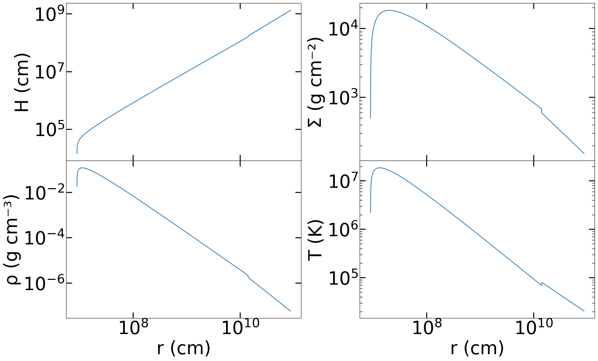
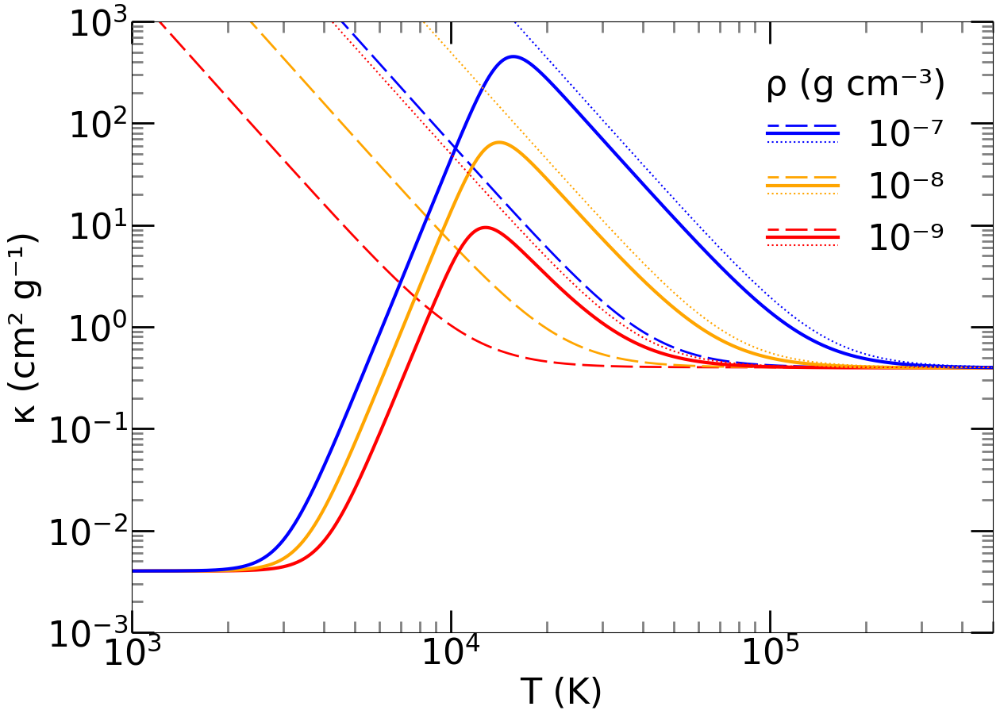
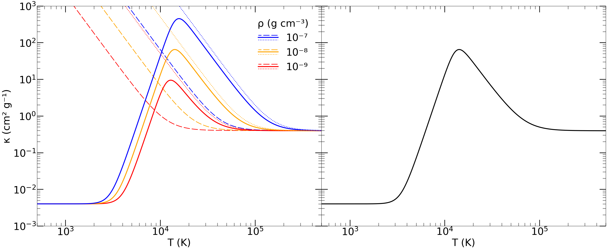

```python
%run diskequations_SS_bath_params.ipynb
```


```python
def Variable_plot_2(rmin, rmax, M, M_dot, NPanels, variable,ax):
    
    rlogarray = np.linspace(np.log10(rmin),np.log10(rmax),NPanels+1)
    rarray = 10**rlogarray
    
    rlogmidpoints = rlogarray + (rlogarray[1]-rlogarray[0])/2
    rlogmidpoints = np.delete(rlogmidpoints,len(rlogmidpoints)-1)  
    rmidpoints = 10**rlogmidpoints
    
    deltar = [x - rarray[i-1] for i, x in enumerate(rarray)][1:] 
    deltar = np.array(deltar)

    Tarray = np.empty(len(rmidpoints)) 
    
    border_ab = 150*((alpha*m(M))**(2/21))*(m_dot(M_dot)**16/21)
    border_bc = (6.3e3)*(m_dot(M_dot)**(2/3))
    
    v = variable
    
    if v == 1:
        tag = 'H (cm)'
        for i in range(len(Tarray)):
            if r_hat(rmidpoints[i],M) < border_ab:
                Tarray[i] = H_inner(rmidpoints[i], M, M_dot)
            elif r_hat(rmidpoints[i],M) > border_bc:
                Tarray[i] = H_outer(rmidpoints[i], M, M_dot)
            else:
                Tarray[i] = H_middle(rmidpoints[i], M, M_dot) 
    elif v == 2:
        tag = 'Σ (g cm⁻²)'
        for i in range(len(Tarray)):
            if r_hat(rmidpoints[i],M) < border_ab:
                Tarray[i] = SIGMA_inner(rmidpoints[i], M, M_dot)
            elif r_hat(rmidpoints[i],M) > border_bc:
                Tarray[i] = SIGMA_outer(rmidpoints[i], M, M_dot)
            else:
                Tarray[i] = SIGMA_middle(rmidpoints[i], M, M_dot)      
    elif v == 3:
        tag = 'ρ (g cm⁻³)'
        for i in range(len(Tarray)):
            if r_hat(rmidpoints[i],M) < border_ab:
                Tarray[i] = rho_inner(rmidpoints[i], M, M_dot)
            elif r_hat(rmidpoints[i],M) > border_bc:
                Tarray[i] = rho_outer(rmidpoints[i], M, M_dot)
            else:
                Tarray[i] = rho_middle(rmidpoints[i], M, M_dot)
    elif v == 4:
        tag = 'υᵣ (cm s⁻¹)'
        for i in range(len(Tarray)):
            if r_hat(rmidpoints[i],M) < border_ab:
                Tarray[i] = u_r_inner(rmidpoints[i], M, M_dot)
            elif r_hat(rmidpoints[i],M) > border_bc:
                Tarray[i] = u_r_outer(rmidpoints[i], M, M_dot)
            else:
                Tarray[i] = u_r_middle(rmidpoints[i], M, M_dot)   
    elif v == 5:
        tag = 'T (K)'
        for i in range(len(Tarray)):
            if r_hat(rmidpoints[i],M) < border_ab:
                Tarray[i] = T_c_inner(rmidpoints[i], M, M_dot)
            elif r_hat(rmidpoints[i],M) > border_bc:
                Tarray[i] = T_c_outer(rmidpoints[i], M, M_dot)
            else:
                Tarray[i] = T_c_middle(rmidpoints[i], M, M_dot)   
    elif v == 6:
        tag = 'т*'
        for i in range(len(Tarray)):
            if r_hat(rmidpoints[i],M) < border_ab:
                Tarray[i] = tau_inner(rmidpoints[i], M, M_dot)
            elif r_hat(rmidpoints[i],M) > border_bc:
                Tarray[i] = tau_outer(rmidpoints[i], M, M_dot)
            else:
                Tarray[i] = tau_middle(rmidpoints[i], M, M_dot)   

    mindex = np.where(Tarray == np.amax(Tarray))
    maxt = str(Tarray[mindex]).lstrip('[').rstrip(']')
    maxtrad = str(rmidpoints[mindex]).lstrip('[').rstrip(']')
    
    ax.plot(rmidpoints, Tarray, label=tag)
    ax.set_yscale('log')
    ax.set_xscale('log')
    ax.set_ylabel(tag)

    # Optionally, add a legend
 #   ax.legend(loc='upper right', borderpad=0.8, title="Property")

    
    return Tarray, rmidpoints

#1 = H
#2 = SIGMA
#3 = rho
#4 = u_r
#5 = T_c
#6 = tau

# Create a figure with four subplots, sharing the x-axis
#fig, axs = plt.subplots(4, 1, figsize=(12, 16), sharex=True)
font = {'weight' : 'normal',
        'size'   : 38}

plt.rc('font', **font)
fig, axs = plt.subplots(2, 2, figsize=(20, 12), sharex=True) 

M1 = 10*solarmass
M_dot1 = 1e17

# Plot each graph on its respective subplot
Variable_plot_2(min_R, max_R, M1, M_dot1, panels, 1, axs[0, 0])
Variable_plot_2(min_R, max_R, M1, M_dot1, panels, 2, axs[0, 1])
Variable_plot_2(min_R, max_R, M1, M_dot1, panels, 3, axs[1, 0])
Variable_plot_2(min_R, max_R, M1, M_dot1, panels, 5, axs[1, 1])

# Set common x-axis label
#axs[-1].set_xlabel("r (cm)")
axs[1, 0].set_xlabel("r (cm)")
axs[1, 1].set_xlabel("r (cm)")

axs[1, 0].minorticks_on()
axs[1, 0].tick_params(axis='both', which='major', direction='in', length=12, width=2, colors='black')
axs[1, 0].tick_params(axis='both', which='minor', direction='in', length=6, width=2, colors='gray')
axs[1, 0].tick_params(axis='both', which='both', top=True, right=True, direction='in')
axs[1, 0].tick_params(labeltop=False, labelright=False)  # Hide labels on top and right
axs[1, 1].minorticks_on()
axs[1, 1].tick_params(axis='both', which='major', direction='in', length=12, width=2, colors='black')
axs[1, 1].tick_params(axis='both', which='minor', direction='in', length=6, width=2, colors='gray')
axs[1, 1].tick_params(axis='both', which='both', top=True, right=True, direction='in')
axs[1, 1].tick_params(labeltop=False, labelright=False)  # Hide labels on top and right
axs[1, 1].minorticks_on()
axs[0, 1].tick_params(axis='both', which='major', direction='in', length=12, width=2, colors='black')
axs[0, 1].tick_params(axis='both', which='minor', direction='in', length=6, width=2, colors='gray')
axs[0, 1].tick_params(axis='both', which='both', top=True, right=True, direction='in')
axs[0, 1].tick_params(labeltop=False, labelright=False)  # Hide labels on top and right
axs[0, 0].minorticks_on()
axs[0, 0].tick_params(axis='both', which='major', direction='in', length=12, width=2, colors='black')
axs[0, 0].tick_params(axis='both', which='minor', direction='in', length=6, width=2, colors='gray')
axs[0, 0].tick_params(axis='both', which='both', top=True, right=True, direction='in')
axs[0, 0].tick_params(labeltop=False, labelright=False)  # Hide labels on top and right


# Adjust the layout
plt.subplots_adjust(hspace=0.0, wspace=.25)
#plt.subplots_adjust(hspace=0.0)

# Show the plot
plt.show()
```

    C:\Users\jezre\AppData\Local\Temp\ipykernel_28104\3335393788.py:26: RuntimeWarning: invalid value encountered in double_scalars
      return (2.7e3)*(alpha**(-1/10))*(m(M)**(9/10))*(m_dot(M_dot)**(1/5))*(r_hat(r,M)**(21/20))*(f(r, M)**(1/5))
    C:\Users\jezre\AppData\Local\Temp\ipykernel_28104\3335393788.py:29: RuntimeWarning: invalid value encountered in double_scalars
      return (4.3e4)*(alpha**(-4/5))*(m(M)**(1/5))*(m_dot(M_dot)**(3/5))*(r_hat(r,M)**(-3/5))*(f(r, M)**(3/5))
    C:\Users\jezre\AppData\Local\Temp\ipykernel_28104\3335393788.py:32: RuntimeWarning: invalid value encountered in double_scalars
      return (8)*(alpha**(-7/10))*(m(M)**(-7/10))*(m_dot(M_dot)**(2/5))*(r_hat(r,M)**(-33/20))*(f(r, M)**(2/5))
    C:\Users\jezre\AppData\Local\Temp\ipykernel_28104\3335393788.py:38: RuntimeWarning: invalid value encountered in double_scalars
      return (2.2e8)*(alpha**(-1/5))*(m(M)**(-1/5))*(m_dot(M_dot)**(2/5))*(r_hat(r,M)**(-9/10))*(f(r, M)**(2/5))
    


    

    


```python
#kappa plotting function

def Kappa_1_plot0(rmin, rmax, rho, NPanels):
    
    rlogarray = np.linspace(np.log10(rmin),np.log10(rmax),NPanels+1)
    rarray = 10**rlogarray
    
    rlogmidpoints = rlogarray + (rlogarray[1]-rlogarray[0])/2
    rlogmidpoints = np.delete(rlogmidpoints,len(rlogmidpoints)-1)  
    rmidpoints = 10**rlogmidpoints
    
    deltar = [x - rarray[i-1] for i, x in enumerate(rarray)][1:] 
    deltar = np.array(deltar)
 
    Karray = np.empty(len(rmidpoints))
    
    for i in range(len(Karray)):
        tag = rho
        Karray[i] = kappa(rho, rmidpoints[i]) 

    mindex = np.where(Karray == np.amax(Karray))
    maxt = str(Karray[mindex]).lstrip('[').rstrip(']')
    maxtrad = str(rmidpoints[mindex]).lstrip('[').rstrip(']')
    
    if rho == 1e-7:
        plot = plt.plot(rmidpoints, Karray, label = tag, linestyle =(5, (10,3)), linewidth = 2, color = 'blue')
    elif rho == 1e-8:
        plot = plt.plot(rmidpoints, Karray, label = tag, linestyle =(5, (10,3)), linewidth = 2, color = 'orange')
    else:
        plot = plt.plot(rmidpoints, Karray, label = tag, linestyle =(5, (10,3)), linewidth = 2, color = 'red')
   # legend = plt.legend(loc='upper left', borderpad = 0.8, title = "ρ",frameon=False)
    
    return plot

def Kappa_2_plot0(rmin, rmax, rho, NPanels):
    
    rlogarray = np.linspace(np.log10(rmin),np.log10(rmax),NPanels+1)
    rarray = 10**rlogarray
    
    rlogmidpoints = rlogarray + (rlogarray[1]-rlogarray[0])/2
    rlogmidpoints = np.delete(rlogmidpoints,len(rlogmidpoints)-1)  
    rmidpoints = 10**rlogmidpoints
    
    deltar = [x - rarray[i-1] for i, x in enumerate(rarray)][1:] 
    deltar = np.array(deltar)
 
    Karray = np.empty(len(rmidpoints))
    
    for i in range(len(Karray)):
        tag = rho
        Karray[i] = kappa_tot(rho, rmidpoints[i]) 

    mindex = np.where(Karray == np.amax(Karray))
    maxt = str(Karray[mindex]).lstrip('[').rstrip(']')
    maxtrad = str(rmidpoints[mindex]).lstrip('[').rstrip(']')
    
    if rho == 1e-7:
        plot = plt.plot(rmidpoints, Karray, label = tag, linestyle ='solid', linewidth = 3, color = 'blue')
    elif rho == 1e-8:
        plot = plt.plot(rmidpoints, Karray, label = tag, linestyle ='solid', linewidth = 3, color = 'orange')
    else:
        plot = plt.plot(rmidpoints, Karray, label = tag, linestyle ='solid', linewidth = 3, color = 'red')
   # legend = plt.legend(loc='upper left', borderpad = 0.8, title = "ρ (g cm⁻³)",frameon=False)
    
    return plot

def Kappa_3_plot0(rmin, rmax, rho, NPanels):
    
    rlogarray = np.linspace(np.log10(rmin),np.log10(rmax),NPanels+1)
    rarray = 10**rlogarray
    
    rlogmidpoints = rlogarray + (rlogarray[1]-rlogarray[0])/2
    rlogmidpoints = np.delete(rlogmidpoints,len(rlogmidpoints)-1)  
    rmidpoints = 10**rlogmidpoints
    
    deltar = [x - rarray[i-1] for i, x in enumerate(rarray)][1:] 
    deltar = np.array(deltar)
 
    Karray = np.empty(len(rmidpoints))
    
    for i in range(len(Karray)):
        tag = rho
        Karray[i] = kappa_bf(rho, rmidpoints[i]) 

    mindex = np.where(Karray == np.amax(Karray))
    maxt = str(Karray[mindex]).lstrip('[').rstrip(']')
    maxtrad = str(rmidpoints[mindex]).lstrip('[').rstrip(']')
    
    if rho == 1e-7:
        plot = plt.plot(rmidpoints, Karray, label = tag, linestyle ='dotted', color = 'blue')
    elif rho == 1e-8:
        plot = plt.plot(rmidpoints, Karray, label = tag, linestyle ='dotted', color = 'orange')
    else:
        plot = plt.plot(rmidpoints, Karray, label = tag, linestyle ='dotted', color = 'red')
   # legend = plt.legend(loc='upper left', borderpad = 0.8, title = "ρ (g cm⁻³)",frameon=False)
    
    return plot
```


```python
font = {'weight' : 'normal',
        'size'   : 32}

plt.rc('font', **font)
plt.figure(figsize=(14, 10))
#plt.title("Plot of opacity w.r.t temperature")
plt.xlabel("T (K)")
plt.ylabel("κ (cm² g⁻¹)")
plt.yscale("log")
plt.xscale("log")

min_T = 1000
max_T = 500000
panels = 1000

plt.xlim(min_T, max_T)
plt.ylim(1e-3, 1e3)


plt.minorticks_on()
plt.tick_params(axis='both', which='major', direction='in', length=20, width=2, colors='black')
plt.tick_params(axis='both', which='minor', direction='in', length=10, width=2, colors='gray')
plt.tick_params(axis='both', which='both', top=True, right=True, direction='in')
plt.tick_params(labeltop=False, labelright=False)  # Hide labels on top and right

k11, = Kappa_1_plot0(min_T,max_T,1e-9,panels)
k12, = Kappa_1_plot0(min_T,max_T,1e-8,panels)
k13, = Kappa_1_plot0(min_T,max_T,1e-7,panels)
k21, = Kappa_2_plot0(min_T,max_T,1e-9,panels)
k22, = Kappa_2_plot0(min_T,max_T,1e-8,panels)
k23, = Kappa_2_plot0(min_T,max_T,1e-7,panels)
k31, = Kappa_3_plot0(min_T,max_T,1e-9,panels)
k32, = Kappa_3_plot0(min_T,max_T,1e-8,panels)
k33, = Kappa_3_plot0(min_T,max_T,1e-7,panels)

from matplotlib.legend_handler import HandlerTuple

class HandlerTupleVertical(HandlerTuple):
    def __init__(self, **kwargs):
        HandlerTuple.__init__(self, **kwargs)

    def create_artists(self, legend, orig_handle,
                       xdescent, ydescent, width, height, fontsize, trans):
        # How many lines are there.
        numlines = len(orig_handle)
        handler_map = legend.get_legend_handler_map()

        # divide the vertical space where the lines will go
        # into equal parts based on the number of lines
        height_y = (height / numlines)

        leglines = []
        for i, handle in enumerate(orig_handle):
            handler = legend.get_legend_handler(handler_map, handle)

            legline = handler.create_artists(legend, handle,
                                             xdescent,
                                             (2*i + 1)*height_y,
                                             width,
                                             2*height,
                                             fontsize, trans)
            leglines.extend(legline)

        return leglines
    
plt.legend([(k13, k23, k33),(k12, k22, k32),(k11, k21, k31)], ['10⁻⁷', '10⁻⁸', '10⁻⁹'],
           handler_map = {tuple : HandlerTupleVertical()},loc='upper right', borderpad = 0.8, title = "ρ (g cm⁻³)",frameon=False)
plt.show()
```


    

    


```python
#kappa plotting function

def Kappa_1_plot1(ax, rmin, rmax, rho, NPanels):
    
    rlogarray = np.linspace(np.log10(rmin),np.log10(rmax),NPanels+1)
    rarray = 10**rlogarray
    
    rlogmidpoints = rlogarray + (rlogarray[1]-rlogarray[0])/2
    rlogmidpoints = np.delete(rlogmidpoints,len(rlogmidpoints)-1)  
    rmidpoints = 10**rlogmidpoints
    
    deltar = [x - rarray[i-1] for i, x in enumerate(rarray)][1:] 
    deltar = np.array(deltar)
 
    Karray = np.empty(len(rmidpoints))
    
    for i in range(len(Karray)):
        tag = rho
        Karray[i] = kappa(rho, rmidpoints[i]) 

    mindex = np.where(Karray == np.amax(Karray))
    maxt = str(Karray[mindex]).lstrip('[').rstrip(']')
    maxtrad = str(rmidpoints[mindex]).lstrip('[').rstrip(']')
    
    # Choose color and linestyle based on rho
    if rho == 1e-7:
        color = 'blue'
        linestyle = (5, (10, 3))
    elif rho == 1e-8:
        color = 'orange'
        linestyle = (5, (10, 3))
    else:  # Assuming rho == 1e-9 or other
        color = 'red'
        linestyle = (5, (10, 3))

    # Plotting using the ax object
    plot = ax.plot(rmidpoints, Karray, label=f'{rho:g}', linestyle=linestyle, linewidth=2, color=color)
    
    return plot

def Kappa_2_plot1(ax, rmin, rmax, rho, NPanels):
    
    rlogarray = np.linspace(np.log10(rmin),np.log10(rmax),NPanels+1)
    rarray = 10**rlogarray
    
    rlogmidpoints = rlogarray + (rlogarray[1]-rlogarray[0])/2
    rlogmidpoints = np.delete(rlogmidpoints,len(rlogmidpoints)-1)  
    rmidpoints = 10**rlogmidpoints
    
    deltar = [x - rarray[i-1] for i, x in enumerate(rarray)][1:] 
    deltar = np.array(deltar)
 
    Karray = np.empty(len(rmidpoints))
    
    for i in range(len(Karray)):
        tag = rho
        Karray[i] = kappa_tot(rho, rmidpoints[i]) 

    mindex = np.where(Karray == np.amax(Karray))
    maxt = str(Karray[mindex]).lstrip('[').rstrip(']')
    maxtrad = str(rmidpoints[mindex]).lstrip('[').rstrip(']')
    
    # Choose color and linestyle based on rho
    if rho == 1e-7:
        color = 'blue'
        linestyle = 'solid'
    elif rho == 1e-8:
        color = 'orange'
        linestyle = 'solid'
    else:  # Assuming rho == 1e-9 or other
        color = 'red'
        linestyle = 'solid'

    # Plotting using the ax object
    plot = ax.plot(rmidpoints, Karray, label=f'{rho:g}', linestyle=linestyle, linewidth=3, color=color)
    
    return plot

def Kappa_3_plot1(ax, rmin, rmax, rho, NPanels):
    
    rlogarray = np.linspace(np.log10(rmin),np.log10(rmax),NPanels+1)
    rarray = 10**rlogarray
    
    rlogmidpoints = rlogarray + (rlogarray[1]-rlogarray[0])/2
    rlogmidpoints = np.delete(rlogmidpoints,len(rlogmidpoints)-1)  
    rmidpoints = 10**rlogmidpoints
    
    deltar = [x - rarray[i-1] for i, x in enumerate(rarray)][1:] 
    deltar = np.array(deltar)
 
    Karray = np.empty(len(rmidpoints))
    
    for i in range(len(Karray)):
        tag = rho
        Karray[i] = kappa_bf(rho, rmidpoints[i]) 

    mindex = np.where(Karray == np.amax(Karray))
    maxt = str(Karray[mindex]).lstrip('[').rstrip(']')
    maxtrad = str(rmidpoints[mindex]).lstrip('[').rstrip(']')
    
    # Choose color and linestyle based on rho
    if rho == 1e-7:
        color = 'blue'
        linestyle = 'dotted'
    elif rho == 1e-8:
        color = 'orange'
        linestyle = 'dotted'
    else:  # Assuming rho == 1e-9 or other
        color = 'red'
        linestyle = 'dotted'

    # Plotting using the ax object
    plot = ax.plot(rmidpoints, Karray, label=f'{rho:g}', linestyle=linestyle, linewidth=2, color=color)
    
    return plot

def Kappa_4_plot1(ax, rmin, rmax, rho, NPanels):
    
    rlogarray = np.linspace(np.log10(rmin),np.log10(rmax),NPanels+1)
    rarray = 10**rlogarray
    
    rlogmidpoints = rlogarray + (rlogarray[1]-rlogarray[0])/2
    rlogmidpoints = np.delete(rlogmidpoints,len(rlogmidpoints)-1)  
    rmidpoints = 10**rlogmidpoints
    
    deltar = [x - rarray[i-1] for i, x in enumerate(rarray)][1:] 
    deltar = np.array(deltar)
 
    Karray = np.empty(len(rmidpoints))
    
    for i in range(len(Karray)):
        tag = rho
        Karray[i] = kappa_tot(rho, rmidpoints[i]) 

    mindex = np.where(Karray == np.amax(Karray))
    maxt = str(Karray[mindex]).lstrip('[').rstrip(']')
    maxtrad = str(rmidpoints[mindex]).lstrip('[').rstrip(']')

    # Plotting using the ax object
    plot = ax.plot(rmidpoints, Karray, label=f'{rho:g}', linestyle='solid', linewidth=3, color='k')
    
    return plot
```


```python
fig, (ax1, ax2) = plt.subplots(1, 2, figsize=(28, 12),gridspec_kw={'wspace': 0})

# Configure the first subplot (ax1)
ax1.set_xlabel("T (K)")
ax1.set_ylabel("κ (cm² g⁻¹)")
ax1.set_yscale("log")
ax1.set_xscale("log")
ax2.set_xlabel("T (K)")
#ax2.set_ylabel("κ (cm² g⁻¹)")
ax2.set_yscale("log")
ax2.set_xscale("log")

min_T = 500
max_T = 500000
panels = 1000

ax1.set_xlim(min_T, max_T)
ax1.set_ylim(1e-3, 1e3)
ax2.set_xlim(min_T, max_T)
ax2.set_ylim(1e-3, 1e3)

ax1.minorticks_on()
ax1.tick_params(axis='both', which='major', direction='in', length=20, width=2, colors='black')
ax1.tick_params(axis='both', which='minor', direction='in', length=10, width=2, colors='gray')
ax1.tick_params(axis='both', which='both', top=True, right=True, direction='in')
ax1.tick_params(labeltop=False, labelright=False)  # Hide labels on top and right
ax2.minorticks_on()
ax2.tick_params(axis='both', which='major', direction='in', length=20, width=2, colors='black')
ax2.tick_params(axis='both', which='minor', direction='in', length=10, width=2, colors='gray')
ax2.tick_params(axis='both', which='both', top=True, right=True, direction='in')
ax2.tick_params(labeltop=False, labelright=False)  # Hide labels on top and right
ax2.set_yticklabels([])

# Assuming Kappa_*_plot0 functions are adapted to plot directly to ax1
k11, = Kappa_1_plot1(ax1, min_T, max_T, 1e-9, panels)
k12, = Kappa_1_plot1(ax1, min_T, max_T, 1e-8, panels)
k13, = Kappa_1_plot1(ax1, min_T, max_T, 1e-7, panels)
k21, = Kappa_2_plot1(ax1, min_T, max_T, 1e-9, panels)
k22, = Kappa_2_plot1(ax1, min_T, max_T, 1e-8, panels)
k23, = Kappa_2_plot1(ax1, min_T, max_T, 1e-7, panels)
k31, = Kappa_3_plot1(ax1, min_T, max_T, 1e-9, panels)
k32, = Kappa_3_plot1(ax1, min_T, max_T, 1e-8, panels)
k33, = Kappa_3_plot1(ax1, min_T, max_T, 1e-7, panels)

# Adding a legend with a title to ax1
ax1.legend([(k13, k23, k33), (k12, k22, k32), (k11, k21, k31)], ['10⁻⁷', '10⁻⁸', '10⁻⁹'],
           handler_map={tuple: HandlerTupleVertical()}, loc='upper right', borderpad=0.8,
           title="ρ (g cm⁻³)", frameon=False)

k4 = Kappa_4_plot1(ax2, min_T, max_T, 1e-8, panels)

plt.tight_layout()  # Adjust the layout to make sure everything fits without overlapping
plt.show()
```


    

    


```python

```
